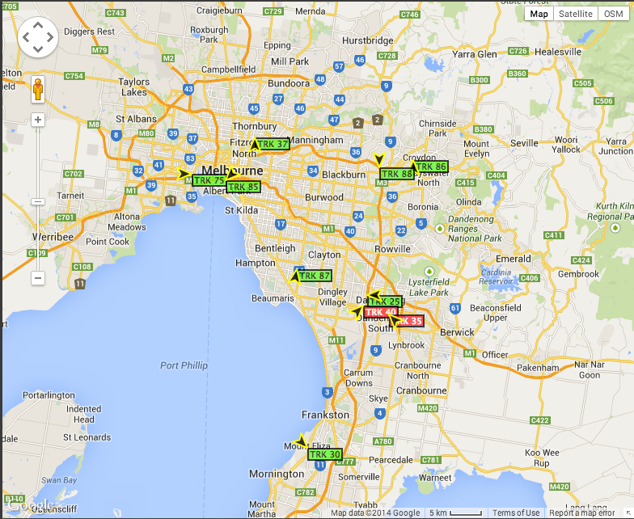
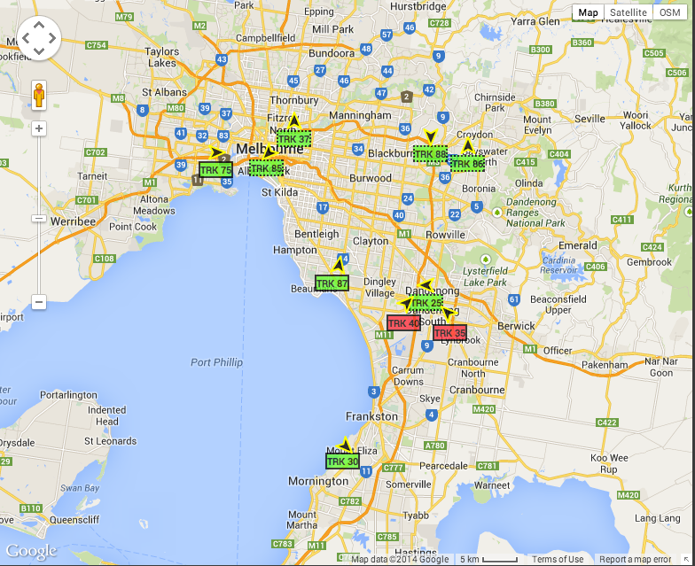

MarkerWithLabel
===============

MarkerWithLabel is a git clone of a google maps utilitiy library hosted in googlecode.com http://google-maps-utility-library-v3.googlecode.com/svn/tags/markerwithlabel/1.1.9/

# Changes

The arrow marker symbol defaults to a (0,0) anchor which is the top left corner of the label.  In order to center the arrow marker symbol on top of the symbol, we need to adjust the anchor point.

	marker.fixAnchor(20, 20, obj.rotation);

Before 

After 

# Reference

## MarkerWithLabel for V3

MarkerWithLabel extends the Google Maps JavaScript API V3 google.maps.Marker class.

MarkerWithLabel allows you to define markers with associated labels. As you would expect, if the marker is draggable, so too will be the label. In addition, a marker with a label responds to all mouse events in the same manner as a regular marker. It also fires mouse events and "property changed" events just as a regular marker would. Version 1.1 adds support for the raiseOnDrag feature introduced in API V3.3.

If you drag a marker by its label, you can cancel the drag and return the marker to its original position by pressing the Esc key. This doesn't work if you drag the marker itself because this feature is not (yet) supported in the google.maps.Marker class.

For a description and examples of how to use this library, check out the how-to.

### class MarkerWithLabel

Constructor

| Constructor | Description |
| ----------- | ----------- |
| MarkerWithLabel(opt_options?:MarkerWithLabelOptions) | Creates a MarkerWithLabel with the options specified in MarkerWithLabelOptions. 

	
### class MarkerWithLabelOptions

This class represents the optional parameter passed to the MarkerWithLabel constructor. The properties available are the same as for google.maps.Marker with the addition of the properties listed below. To change any of these additional properties after the labeled marker has been created, call google.maps.Marker.set(propertyName, propertyValue).

When any of these properties changes, a property changed event is fired. The names of these events are derived from the name of the property and are of the form propertyname_changed. For example, if the content of the label changes, a labelcontent_changed event is fired.

There is no constructor for this class. Instead, this class is instantiated as a javascript object literal.

Properties

| Properties | Type | Description |
| -----------|------|-------------|
| crossImage | string | The URL of the cross image to be displayed while dragging a marker. The default value is "http://maps.gstatic.com/intl/en_us/mapfiles/drag_cross_67_16.png". |
| handCursor | string | The URL of the cursor to be displayed while dragging a marker. The default value is "http://maps.gstatic.com/intl/en_us/mapfiles/closedhand_8_8.cur". |
|labelAnchor | Point | By default, a label is drawn with its anchor point at (0,0) so that its top left corner is positioned at the anchor point of the associated marker. Use this property to change the anchor point of the label. For example, to center a 50px-wide label beneath a marker, specify a labelAnchor of google.maps.Point(25, 0). (Note: x-values increase to the right and y-values increase to the top.)|
|labelClass | string | The name of the CSS class defining the styles for the label. Note that style values for position, overflow, top, left, zIndex, display, marginLeft, and marginTop are ignored. These styles are for internal use only.
|labelContent|string or node | The content of the label (plain text or an HTML DOM node)|
|labelInBackground | boolean | A flag indicating whether a label that overlaps its associated marker should appear in the background (i.e., in a plane below the marker). The default is false, which causes the label to appear in the foreground.|
|labelStyle | Object | An object literal whose properties define specific CSS style values to be applied to the label. Style values defined here override those that may be defined in the labelClass style sheet. If this property is changed after the label has been created, all previously set styles (except those defined in the style sheet) are removed from the label before the new style values are applied. Note that style values for position, overflow, top, left, zIndex, display, marginLeft, and marginTop are ignored; these styles are for internal use only.|
|labelVisible |boolean|A flag indicating whether the label is to be visible. The default is true. Note that even if labelVisible is true, the label will not be visible unless the associated marker is also visible (i.e., unless the marker's visible property is true).|
|optimized | boolean | A flag indicating whether rendering is to be optimized for the marker. Important: The optimized rendering technique is not supported by MarkerWithLabel, so the value of this parameter is always forced to false.|
|raiseOnDrag | boolean | A flag indicating whether the label and marker are to be raised when the marker is dragged. The default is true. If a draggable marker is being created and a version of Google Maps API earlier than V3.3 is being used, this property must be set to false.|